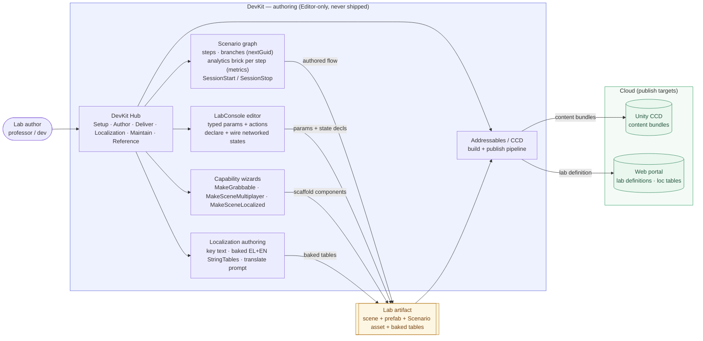
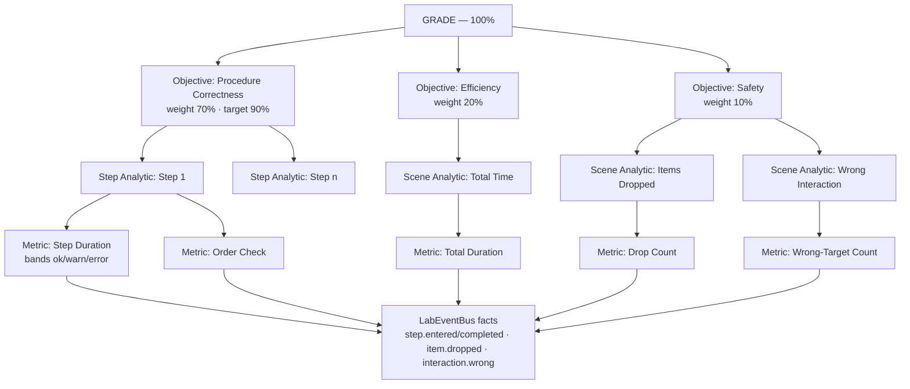
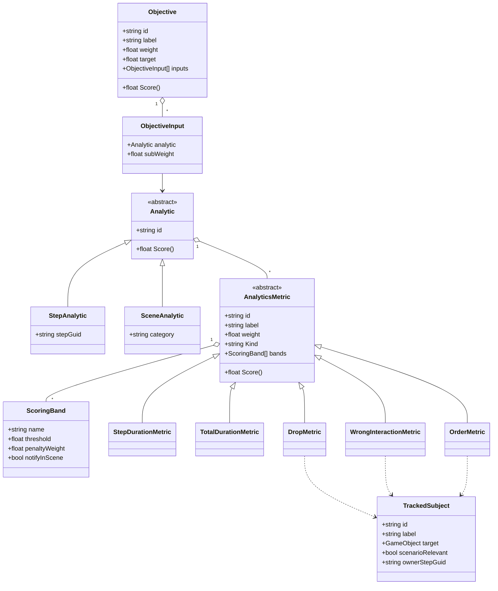

> **How to read this.** **Part A** (§1–§5) is the **observed current state** — every claim read from the actual
> `.cs`/`.asmdef` on 2026-06-19 and verified by re-opening the cited locations. It does **not** trust the plan/spec
> docs; where they disagree with code, the code wins. **Part B** (§6–§12) is the **synthesized target architecture**
> (DESIGN, forward-looking) — what we are building toward, reconciled with the ratified plans + this chat. **Part C**
> (§13–§14) is the **B.1 / B.2 plan split**. "Not in code yet" = planned work, never a defect.

> **Decision log (2026-06-19, Stergios):** **(1)** full step-sync — *including branches* — ships at launch, so the
> path-list **forwarding** mechanism (not the B9 bool bridge) is the launch multiplayer solution. **(2)** Phase B splits
> into **B.1 (structural, behavior-neutral)** + **B.2 (features: analytics, multiplayer, localization)**. **(3)** the
> `LabEventBus` is a real planned build — the notification spine, not "vapor" (it does not exist in code yet; built in B.1 — §5/§13). **(4)** no per-step sync semantics yet — uniform
> AnyCompletes at launch.

> **Decision log (2026-06-22, Stergios):** **(5)** **LMS interop (xAPI / SCORM / cmi5 / LTI) is DEFERRED** — VICKY is the
> system of record ("the new Moodle"), not a plugin into an external LMS; if a tenant ever requires it, it is an
> edge-side adapter, never a device-contract change (§11). **(6)** **scenario data durability** is a layered plan
> (§9.2 + §15): `[MovedFrom]` / `[FormerlySerializedAs]` migration discipline + a dangling-guid lint at launch (**D**),
> plus a **portable `kind`-discriminated scenario JSON contract** whose *shape is frozen now* (round-trip importer built
> post-launch) — the precondition for LLM / portal authoring. **(7)** the localization **keying standard already exists**
> in the VR app — it is *relocated + extended*, not invented (§12). **OPEN:** does the JSON contract become the eventual
> *source of truth* (portal stores/edits it; scene imports) or stay export-only? (§14 Open Decision #7.)

> **Decision log (2026-06-22b, review resolutions):** **(8)** MP launch model = **symmetric student co-op** (no runtime
> instructor; AnyCompletes; authority = write-serializer only) — arbitration rules in §10.5; instructor override is
> post-launch. **(9)** **no live outside-in control at launch** — the running lab is student-driven, professor control is
> edit-time authoring, VICKY is post-launch; so LabConsole's gated write-door (channel 3) ships but is **dormant** at
> launch (only the trusted step-effect + flow channels are live — §6). **(10)** the `LabEventBus` is **lab-scoped** (owned
> by `LabRuntimeContext`, facts carry `attemptId`/`labInstanceId`), **not** a global `XRServices` singleton (§7).

> **Decision log (2026-06-22c, split-gate review):** **(11)** **B.1 = FULL** — runner extraction + the `SceneManager →
> LabConsole` rename ship at launch (§13 table; §14 #1 resolved); the divergent-twin dedup still stays post-launch (§9.1).
> **(12)** **two freeze gates, not one** (per `VICKY_1_0_LAUNCH.md` §2): cross-surface contracts at **G2 = 2026-06-29**,
> the DevKit SDK emit-API surface at **2026-07-07** — §13.

> **Decision log (2026-06-23, battle-test resolutions):** **(13)** **session roles** Professor / Participant / Spectator
> gate **analytics only**, never flow/interaction — anyone completes steps and it counts; Participants → full analytics,
> Professors → presence only, Spectators → none; per-lab capacities in LabConsole (§11). **(14)** **one unified param/state
> system** — the typed param store **supersedes Stats** (deprecated) AND owns networked scene-state; `ILabStateStore` is its
> bool-view; triggers/listeners are sugar over *declared* params (§8). **(15)** the **networked store is SCENE-AUTHORED**,
> not runtime-spawned (Fusion prefab-table constraint), lab-scoped via parent-scope-walk, not a static singleton (§10.2).
> **(16)** branch resolution = **first-completion wins, no decider** (co-op decisions are single-driver by UX) (§10.5).
> **(17)** verification = EditMode net + **dev-playtest checklist** (SP) + on-device 2-client proofs (MP); golden-trace is
> post-launch only (§9.1/§15). (scene-vs-prefab was then-open — **now resolved**, see below.)

> **Decision log (2026-06-23, finalize resolutions):** **(18)** lab delivery = **leave as-is for launch** (VR shell+scene,
> AR DevKit+prefab, separate); *future* = merge orchestration into the DevKit (noted, post-launch) — §14 #8. **(19)**
> **rename everything to the correct names**; nothing breaks via `[MovedFrom]` / upgrader + **Hub→typed-refs** + dangling-guid
> lint (§8, §14 #3). **(20)** param **schema** = a `ParamValue` union in one store; **min/max ENFORCED** (clamp) — verify no
> lab relied on out-of-range (§8). **(21)** `SessionStart/Stop` = **two new step types** (§14 #5). **(22)** JSON contract =
> **manual import + export** at launch; in-scene canonical (§14 #7). **(23)** offline durability = **host-owned outbox,
> verified as a tested contract** (§11). **(24)** bus = **sync in-process, snapshot facts** (local delivery; emitter
> batches + ships at end — §11). **(25) b6 RESOLVED:** analytics = **ONE self-contained session report** (users+roles +
> timed events + bundled rubric, merged on-device, shipped at `SessionStop`, stored once tenant-scoped) — **session/group-level**,
> not per-participant docs; **tenant + user id** in `LaunchContext` + report envelope; role/attempt in-scene; cloud
> wire-format = session-report schema (supersedes per-event `AnalyticsEventV1` — align Web-Portal before G2) — §11.

> **Decision log (2026-06-25, analytics architecture session):** **(26)** analytics = a **four-layer hierarchy** —
> **Objectives → Analytics (step + scene-wide) → Metrics → bus facts** — with the grade a **nested normalized weighted
> mean + applicability mask** (§11.3). **(27)** analytics config is **NOT fields on `Step`** (this **supersedes** the old §11
> "serialized `bool` + inspector analytics options" model): it's a **sidecar rubric keyed by `step.guid`, shown as a brick
> tied to the step** in the scene graph. Load-bearing split = **measurement layer** (metrics, authored in Unity, fixed) vs
> **grading layer** (objectives, teacher-tunable, **re-computable in the portal** from the bundled raw report). **(28)** a
> metric = polymorphic **`AnalyticsMetric`** (duration/drops/wrongInteraction/order) with **scoring bands**
> (none/warning/error → `penaltyWeight` + `notifyInScene`); **static weight at launch, curves deferred**. **(29)** a
> **subjects registry** (`TrackedSubject` = `scenarioRelevant` + `ownerStepGuid`) on its own tab, **auto-detected from
> `InsertStep` + `SelectionStep`** (the only interactable-bearing steps), powers **drops + wrong-interaction + order** from
> one list. **(30)** **severity is derived** from registry attributes + interaction kind (relevant→error · distractor→
> warning/none · out-of-order→warning · authored wrong-target→error), **author-overridable**; importance = `penaltyWeight`.
> **(31)** `RuntimeTelemetryAdapter` is **reused as the egress scaffold** but B.1 must fix its **string-reflection coupling
> to `SceneManager`** (the rename breaks telemetry), per-frame `FindObjectsOfType`, and lack of per-step duration — **the bus
> subscription fixes all three**; its per-event contract is superseded by the session report. **(32)** launch-critical
> metrics = **time (per-step + total) + items-dropped**; wrong-interaction cheap; order ready-but-off until owner-steps
> tagged. **OPEN confirms:** penalty semantics · applicability masking · `target` = pass-bar · default severity table (§11.8).

---

## 0. Diagrams — target launch architecture

Two views of the Part-B target. 🟦 control plane (LabConsole) · 🟧 notification plane (LabEventBus) · 🟪 the seam ·
🟩 cloud · dashed = post-launch.

### 0.1 DevKit as a dev tool (edit-time / authoring)



### 0.2 DevKit at runtime (the running lab)

```mermaid
flowchart LR
  subgraph HOST["VR scene runtime — Quest headset / Mobile UaaL"]
    direction TB
    shell["Host app shell<br/>auth · entitlements · consent · language"]
    scene["Lab scene + prefab<br/>3D · interactables · timelines"]
    peers["Co-op Fusion peers"]
  end
  subgraph DEVKIT["DevKit runtime — com.pitech.xr.devkit"]
    direction TB
    subgraph SPINE["ContentDelivery — launch + delivery spine"]
      lc["LaunchContext<br/>labId · cohort · locale · consent"]
      spawn["Addressables / CCD<br/>load lab (scene on VR / prefab — §14 #8)"]
    end
    subgraph CONTROL["LabConsole — CONTROL plane (ch.3 gated door — dormant @ launch)"]
      door["Set / Invoke / Observe<br/>validate → authorize → audit<br/>(dormant @ launch)"]
      params["Typed param store<br/>typed ids · ranges · actor · effects"]
    end
    seam{{"ISceneRunnerControl<br/>control seam: ignite · position · restart"}}
    subgraph ENGINE["Scenario engine"]
      runner["Runner — Run()<br/>walks steps · nextGuid routing"]
      data["Scenario data<br/>steps + branches"]
      feat["Lab features<br/>Quiz · Interactables"]
    end
    bus(["LabEventBus — NOTIFICATION plane<br/>step / session facts · ScenarioFactKeys"])
    subgraph NET["Networking — Fusion-gated (Local seam = single-player identical)"]
      mpflow["FusionScenarioPath = IScenarioFlowStore impl<br/>FLOW sync = entered-step path<br/>branch records itself"]
      mpstate["ILabStateStore (scene-authored)<br/>Local/Networked · triggers · listeners"]
    end
    analytics["Analytics emitter<br/>role-gated · assemble session report → cloud"]
    loc["Localization<br/>locale → merge baked + cloud tables"]
    vicky["VICKY observe / actuate<br/>post-launch"]
  end
  subgraph CLOUD["Cloud — Supabase + Unity CCD"]
    direction TB
    ccd[("CCD content bundles")]
    loctbl[("Localization tables<br/>professor-edited / new langs")]
    ingest["analytics ingest<br/>+ lab_scenarios"]
    portal["Instructor portal<br/>readout · dashboards"]
  end
  shell -->|"launch ctx"| lc
  ccd -->|"bundles"| spawn
  lc --> spawn
  spawn -->|"instantiate"| scene
  lc -->|"locale"| loc
  loctbl -.->|"cloud tables (later)"| loc
  loc -->|"resolved text"| scene
  spawn -->|"ignite"| seam
  seam --> runner
  runner --> data
  runner -->|"drive"| feat
  runner -->|"step effects (ch.1, trusted)"| params
  shell -.->|"professor panel (post-launch)"| door
  peers -->|"RPC_RequestAdvance (ch.2)"| mpflow
  vicky -.->|"+ 3 gates (post-launch)"| door
  door --> params
  door -.->|"flow verbs (post-launch override)"| seam
  runner -->|"step / session facts"| bus
  door -->|"param-changed"| bus
  bus --> analytics
  runner -->|"append entered guid (IScenarioFlowStore)"| mpflow
  params -->|"networked params"| mpstate
  bus -.-> vicky
  mpflow -->|"follow frontier"| runner
  mpstate -->|"listeners react"| scene
  mpflow <-->|"Fusion"| peers
  mpstate <-->|"Fusion"| peers
  analytics -->|"session report"| ingest
  ingest --> portal
  classDef control fill:#e6f0ff,stroke:#2b6cb0,color:#1a365d;
  classDef notify fill:#fff3e0,stroke:#dd6b20,color:#7b341e;
  classDef cloud fill:#eaf7ee,stroke:#2f855a,color:#22543d;
  classDef seamc fill:#faf5ff,stroke:#805ad5,color:#44337a;
  classDef future fill:#f7fafc,stroke:#a0aec0,color:#718096,stroke-dasharray:4 4;
  class door,params control;
  class bus notify;
  class seam seamc;
  class ccd,loctbl,ingest,portal cloud;
  class vicky future;
  style CONTROL fill:#eef4ff,stroke:#3182ce
  style NET fill:#fffaf0,stroke:#dd6b20
  style ENGINE fill:#f7fafc,stroke:#718096
  style SPINE fill:#f0fff4,stroke:#38a169
  style DEVKIT fill:#ffffff,stroke:#2d3748
```



---

# PART A — Current state (observed, code-grounded)

## The one-sentence shape (today)

There is **one engine** (`SceneManager`) and **one spine** (`ContentDelivery`), wired to each other by **string
reflection** — not by the typed seam that exists for exactly that purpose. Around them sit **leaf features**, a band of
**empty "future" stubs**, and one **orphan pipeline**. There is **no event bus and no LabConsole in code** — both are
the planned target (Part B).

---

## 1. Module map (the real asmdef boundaries)

11 runtime + 5 editor + 4 test assemblies. Status: ✅ real · ⚠️ partial · ❌ vapor.

| Module (asmdef) | Layer | What it actually is | Status |
|---|---|---|---|
| `Pitech.XR.Core` | contracts | `XRServices` locator (real, used) + `ISceneRunnerControl` & `ScenarioFactKeys` seams with **zero callers** | ⚠️ partial (seams inert) |
| `Pitech.XR.Scenario` | **engine** | **THE RUNNER** = `SceneManager` (~2,500 LOC, one `Run()` coroutine). `Scenario.cs` = data holder | ✅ real |
| `Pitech.XR.Stats` | feature | Parameter store: `StatsConfig` (SO) + `StatsRuntime` (C# `OnChanged`) + `StatEffect` ops | ✅ real |
| `Pitech.XR.Interactables` | feature | Selection/picking (`SelectablesManager`, `SelectionLists`) — EventSystem + Meta VR paths | ✅ real |
| `Pitech.XR.Quiz` | feature | MCQ engine (`QuizSession` scoring + 2 UI controllers); runner-agnostic | ✅ real |
| `Pitech.XR.ContentDelivery` | **spine** | Launch + Addressables/CCD spawn + telemetry. Drives & observes the runner **by reflection** | ✅ real |
| `Pitech.XR.AgentSubstrate` | future | Full consent-gated HTTP observation egress — **fed by nothing in-package** | ⚠️ real-but-orphan |
| `Pitech.XR.Analytics` | future | **Empty** `AnalyticsModule.cs`. Real analytics lives in `ContentDelivery/Analytics` | ❌ vapor |
| `Pitech.XR.Networking` | future | **Empty.** `PITECH_HAS_FUSION` define wired, guards no code | ❌ vapor |
| `Pitech.XR.Localization` | future | **Empty.** `PITECH_HAS_LOCALIZATION` wired; **`LaunchContext` has no locale field** | ❌ vapor |
| `Pitech.XR.Vitals` | future | **Empty** namespace, zero types, zero callers | ❌ vapor |
| `Core.Editor` | editor | The **DevKit Hub** (6 pages + 9 services). Wires runtime by reflection; typed only to ContentDelivery; `LocalizationPage` render-only | ✅ real (page vapor) |
| `Scenario.Editor` | editor | The **node-graph** authoring `nextGuid` routes + fixture/baseline/repair toolchain | ✅ real |
| `Interactables.Editor` | editor | **MakeGrabbable** wizard (the one realized wizard) + inspectors | ✅ real |
| `Quiz.Editor` | editor | QuizAsset inspector + default-UI prefab copy command | ✅ real |
| `ContentDelivery.Editor` | editor | Addressables/CCD **build + publish pipeline** (driven by Hub's AddressablesBuilderWindow) | ✅ real |
| `Stats.Editor` (folder) | editor | Real `[CustomEditor]` inspectors **orphaned by a missing asmdef → excluded from package compilation** (fix = add `Pitech.XR.Stats.Editor.asmdef`) — not dead code | ⚠️ broken (fixable) |

> **Multiplayer today lives in the VR app, NOT the DevKit:** `VR Shell and Labs/HealthOn VR/Assets/Scripts/Multiplayer/
> NetworkedStates/` — `NetworkStateManager` (Fusion `NetworkDictionary<NetworkString<_64>, NetworkBool>`, ≤64, singleton)
> + triggers (`UIStateTrigger`, `PhysicsStateTrigger`) + listeners (`EventStateListener` polls `GetState`,
> `TimelineStateListener`) + `NetworkedInteractionRelay`. (The root CLAUDE.md's "VR not present" note is now **stale** —
> the project is in the workspace.)

---

## 2. The architecture diagram (today)

```
EDITOR  (never in player builds)
  DevKit Hub (Core.Editor) ──typed──▶ ContentDelivery(.Editor)     [Addressables/CCD publish pipeline]
        └─── reflection ───▶ Scenario / Stats / Quiz / Interactables   [scaffold + wire features]
  Scenario.Editor ──typed──▶ Scenario     [node-graph authors the nextGuid routes the engine walks]
══════════════════════════════════════════════════════════════════════════════════
RUNTIME
  LaunchContext        ┌──────────────── ContentDelivery  =  THE SPINE ─────────────────┐
  (UaaL bridge /  ───▶ │  resolve ctx → Addressables-spawn lab prefab → telemetry OUT     │
   Unity provider)     └──────┬───────────────────────────────────────┬──────────────────┘
                              │ DRIVES by reflection (autoStart/Restart)│ OBSERVES by reflection-poll (StepIndex)
                              ▼                                        ▼
                 ┌──────────────── SceneManager  =  THE RUNNER  (Pitech.XR.Scenario) ───────────────┐
                 │  Run() walks Scenario.steps → advances by nextGuid STRING routing                  │
                 │  reaches DOWN into: Stats · Quiz · Interactables ; fires author UnityEvents         │
                 └────────────────────────────────────────────────────────────────────────────────────┘
  DEAD SEAMS:  Core.ISceneRunnerControl (3 members)  ·  Core.ScenarioFactKeys (consts)
  STUBS:       Vitals · Analytics · Networking · Localization      ORPHAN: AgentSubstrate
  VR-APP ONLY: NetworkStateManager switchboard (+ triggers/listeners)
```

### Dependency edges (verified, asmdef GUIDs resolved)
- `Scenario → Core` (implements `ISceneRunnerControl`, forwarders only; does **not** use `ScenarioFactKeys`)
- `Scenario → Interactables / Quiz / Stats` (declared **and** runtime — the runner owns these leaves)
- `ContentDelivery → Core` (uses `XRServices`); **`ContentDelivery → Scenario` asmdef edge deliberately ABSENT** — coupling is string reflection
- `Stats` / `Quiz` declare **no** Core/Scenario ref (runner-agnostic); `Interactables → Core` declared but unused
- `Analytics / Networking / Localization / Vitals / AgentSubstrate → Core` declared but unused (empty/orphan)
- `Core.Editor → Core + ContentDelivery(+.Editor)` typed (the one typed runtime↔editor coupling); rest by reflection

---

## 3. End-to-end runtime data flow (OBSERVED, file:line)

1. **Launch.** `AddressablesBootstrapper.Awake` news-up `ContentDeliveryRuntimeService`, registers in `XRServices` (`:37-38`). `SetLaunchContext` fires `OnLaunchContextResolved` + installs `AddressablesRemoteUrlRewriter`.
2. **Spawn.** `ContentDeliverySpawner` loads catalog → downloads → `Instantiate`s the lab prefab (carries `Scenario`+`SceneManager`).
3. **Runner start — by reflection.** `SceneRunnerReflection.TrySetAutoStart`/`TryRestart` find the runner by `FullName` (`:14-47`; called `AddressablesBootstrapper.cs:50,68`). The seam exists but is **not** used.
4. **Run loop.** `SceneManager.Start→Restart→Run()` (`:157-167`); `Run()` (`:169-262`) sets `StepIndex`, type-switches the `Step`, resolves a `branchGuid`, jumps via `FindIndexByGuid` (`:264-271`). **String routing IS how scenarios advance — no events.**
5. **Features fire.** `RunSelection` **polls** `SelectionLists.EvaluateActive()` per frame (`:602`); `RunQuiz` returns via an `Action<QuestionResult>` closure. Quiz/Interactables C# events have **zero subscribers**.
6. **Stats mutate.** `ApplyEffects → StatEffect.Apply → StatsRuntime` (`:1195-1217`); `ApplyQuizStats` writes magic keys (`:736-757`). `StatsRuntime.OnChanged`'s only subscriber is `StatsUIController`.
7. **Telemetry — derived by polling.** `RuntimeTelemetryAdapter.AutoTrackScenarioSteps` (`:504-563`) finds the runner by **global `FindObjectsOfType`** (`:567,576`), reads `StepIndex` by reflection (`:593`), synthesizes `step_entered`/`step_completed`/attempt-completed (hand-typed strings, **not** `ScenarioFactKeys`), ships JSON (`contractVersion "1.2.0"`).

> **Net:** the only push-events are `OnLaunchContextResolved` (launch) and `StatsRuntime.OnChanged` (UI). Step flow = string routing + author UnityEvents + reflection-poll telemetry.

---

## 4. The runner — placement answers (from code)

- **(a)** The runner **is** `SceneManager` (`:21`), a MonoBehaviour — not a separate type. `Scenario.cs` is pure data.
- **(b)** It lives **inside** `Pitech.XR.Scenario`, separate from the data model but **not its own type/module** — a god-class fusing run-loop + Stats/Quiz/Interactables/UI orchestration. The intended extraction line is the existing `Core.ISceneRunnerControl` seam (which SceneManager implements as forwarders, but **nobody calls**).
- **(c)** LabConsole **does not exist** (one doc-comment). The runner self-drives; ContentDelivery + the editor drive it by reflection.
- **(d)** **No EventBus** in code.
- **(e)** Events flow by **(1)** `nextGuid` string routing, **(2)** author `UnityEvent`s, **(3)** reflection-poll telemetry. Feature results reach the runner by **polling** + **`Action<T>` callbacks**. `ScenarioFactKeys` is **inert**.

---

## 5. Real vs vapor

**Real & load-bearing:** SceneManager run-engine · Scenario data model · `XRServices` · Stats store · Quiz scoring · Interactables · ContentDelivery launch/spawn/telemetry · `SceneRunnerReflection` · the Hub + Addressables pipeline · `Scenario.Editor` graph · (VR app) the `NetworkStateManager` switchboard.

**Real-but-orphan:** `AgentSubstrate` (complete observation egress, fed by nothing).

**Inert (exists, unused):** `ISceneRunnerControl` (implemented, zero callers) · `ScenarioFactKeys` (consts, zero emitters/consumers).

**Planned (deliberate future builds — NOT defects):** `LabConsole` · `LabEventBus` · the typed param store · `IScenarioFlowStore`/path-store · the analytics step-config + session steps · the localization merge — all **Part B**.

**Vapor (doc-only / empty):** the `Vitals`/`Analytics`/`Networking`/`Localization` empty modules · the Hub `LocalizationPage` · the "capability-wizard framework" (only `MakeGrabbable` realized).

**Defects:** `Stats.Editor` has no asmdef → its real `[CustomEditor]` scripts are excluded from package compilation (fix = add `Pitech.XR.Stats.Editor.asmdef`; orphaned, not dead code). `RuntimeTelemetryAdapter` global `FindObjectsOfType` → multi-runner mis-bind. Stale plan claims (a "pending" `EvalCompare` deletion + a rename **already happened**; `ScenarioFactKeys` documented as "wired" is inert). **CRITICAL — needs further review:** `AddressablesRemoteUrlRewriter.Install()` overwrites the **global** `Addressables.ResourceManager.InternalIdTransformFunc` without saving the prior, and `Uninstall()`/`Clear()` null it unconditionally (`AddressablesRemoteUrlRewriter.cs:118-138`, verified) → in UaaL (shared process) it can stomp the host React-Native app's Addressables. Likely fix = capture-prior / chain / restore + a regression test — flagged for further review, not yet specced.

---

# PART B — Target architecture (DESIGN)

## 6. LabConsole — the orchestrator (what SceneManager becomes)

**LabConsole is the lab's authoring + orchestration hub** — and *that* is its live-at-launch value, **not** the (dormant)
gated door. Three faces:
- **Edit-time (the DX win, live at launch):** the editor window where you **declare typed params, wire networked-state
  triggers/listeners (picked from the declared set — no hand-typed strings), mark analytics Actions, and set the per-lab
  role capacities** — and *see* the wiring. This is the "develop and read a scene easier" half of the vision.
- **Runtime:** owns the typed param store (§8) and **conducts** the runner via `ISceneRunnerControl`.
- **Post-launch:** the **gated door for OUTSIDE-IN writes** (a live professor panel, later VICKY) — `Set<T>` / `Invoke` /
  `Observe`, *"VICKY = another client with three gates: consent · role · audit."* The door **ships but is dormant at launch**
  (no live outside-in clients yet — §7 channel 3).

**Three write channels, not one (resolves the "one door" ambiguity).** A running lab has three distinct writers, and they
must NOT share a path: **(1) step-internal effects** — the runner's own authored `ApplyEffects` / `ApplyQuizStats`
(`SceneManager.cs:1195` / `:736`) run on a **trusted, ungated** in-engine path (gating the author's own per-frame effects
with consent/audit is nonsensical); **(2) flow advance (incl. peer)** — through the runner + the path-list RPC (§10),
**validated** (read-gate-forbidden, side-effect isolation), *not* the consent gate; **(3) outside-in param/state writes** —
the LabConsole gated door (validate→authorize→audit). **At launch only channels 1–2 are live** (decided 2026-06-22): there
is no live outside-in control — professor control is edit-time authoring, VICKY is post-launch — so the channel-3 gate
ships as the contract but is **dormant** until its clients arrive.

**The reconciliation (code-faithful, Petros's vision):** in code there is **no bus and SceneManager already IS the
orchestrator** (binds every subsystem, owns the param store, drives the runner, has its editor window). So the move is
**evolve SceneManager into LabConsole** (in-scene component + editor window + typed params/actions + conductor) **and
extract the step-execution engine out from under it** into a clean inner runner driven via `ISceneRunnerControl`. *Not a
bolt-on, not a re-fused monolith.* LabConsole is **not** the bus and **not** the runner — it's the control conductor.

**Sequencing (full B.1).** The *additive* role-pieces — param store · editor window · bus + flow-store hooks — land
**first** (low-risk); the **run-engine extraction + the `SceneManager → LabConsole` rename land last** as the slip-eligible
tail (§14) — they're code-health, and nothing else (bus / params / path-store / analytics / loc) depends on them.

---

## 7. The two planes — control (`ISceneRunnerControl`) + notification (`LabEventBus`)

A running lab has two orthogonal flows; each gets its own path:

```
        WRITE — three channels (NOT "one door")          READ — LabEventBus (notification)
        "change the lab"                                 "know what changed"

  ch.3 OUTSIDE-IN (dormant @ launch):                            ┌─► analytics emitter → cloud
       professor / VICKY ─► LabConsole gated door               ├─► VICKY observer (later)
                            (validate→authorize→audit) ──┐       └─► on-screen UI
  ch.2 FLOW (incl. peer) ─► path-list RPC (validated) ───┼─► state ──emits fact──► LabEventBus
  ch.1 STEP EFFECTS ─► runner ApplyEffects (trusted) ────┘
       apply targets: param store · effect handlers · runner via ISceneRunnerControl

  FLOW-SYNC IS SEPARATE: the runner writes entered guids to IScenarioFlowStore
  (Local/Fusion) — the bus does NOT carry flow-sync (§10, Design 2).
```

- **`LabEventBus`** = the notification spine (the launch-plan's "central hub"). The runner raises step/session facts onto
  it; consumers (**analytics / UI / VICKY-observe**) subscribe. Replaces today's reflection-poll telemetry. **Facts out
  only · fire-and-forget / non-blocking · in-process.** It is **per-lab and local to one machine — it never crosses the
  network** (each peer has its own bus; the cross-peer transport is Fusion, §10). Cloud = a transport subscriber's job.
- **`ISceneRunnerControl`** = the **control** seam — ignite · position · restart (the 3 frozen members in `Core`; **do not
  widen** — flow verbs `advance_step`/`branch_to` are a post-launch addition routed via LabConsole, per `ISceneRunnerControl.cs`).
  ContentDelivery (and, later, LabConsole) drive the runner through it. Replaces today's reflection ignition.
- **`IScenarioFlowStore`** = the **flow-store** seam *beneath* the runner (distinct from the control seam) — the
  append-only path the runner **writes** (drive) and **reads** (follow). Two impls: `LocalScenarioPath` (single-player,
  always compiled) + `FusionScenarioPath` (`#if PITECH_HAS_FUSION`, in Networking). **Flow-sync rides THIS seam, not the
  bus.** **Internal at launch** — DevKit-only via `[InternalsVisibleTo]`, reshape freely, off the Proof-B public surface;
  **graduates to a frozen `public` API post-launch (Phase E)** so consumers can supply custom transports / replay.
- **`ScenarioFactKeys`** = the key vocabulary the facts ride (`flow.step.<guid>`). The bus carries; the keys name.
- **Lives in `Pitech.XR.Core`** so producer (`Scenario`) and consumers (`ContentDelivery`/Analytics, `Networking`,
  `AgentSubstrate`) reference *Core*, never each other (acyclic). **Why a bus, not a C# event:** a direct event forces
  consumers to reference `Scenario` (the reason ContentDelivery reflection-pokes today); the bus-in-Core is the
  decoupling point.
- **Lab-scoped instance, NOT a global singleton.** The bus is a Core *interface* (`ILabEventBus`), but the **instance is
  created per attempt at lab-spawn**, owned by a `LabRuntimeContext` on the spawned lab root (created by ContentDelivery,
  which already owns the attempt/launch lifecycle). Consumers resolve it **from that root**, never from the global
  `XRServices` static map (`XRServices.cs:13`) — a global bus reintroduces the same multi-runner mis-bind class §5 flags in
  the telemetry adapter (true even single-lab: stray/editor/additive runner objects). **Every fact carries `attemptId` +
  `labInstanceId`** (part of the DevKit SDK emit surface frozen 2026-07-07 — §13).
- **The write flow:** the bus is one-way (facts out). An **outside-in** write (channel 3) goes **through LabConsole's gated
  door** → validate→authorize→apply (param store / effect / seam) → audit → **then** emits a fact — the door is where
  consent/role/audit/medical-guardrails live *for outside-in actors*. Channel-1 step effects and channel-2 flow advance
  emit their facts directly (trusted / separately validated — §6); they do **not** pass the consent gate.
- **Observation is two channels:** events (push, `LabEventBus`) + state snapshot (pull, `IAgentStateSource`/`ILabObserver`,
  e.g. `PatientVitals`). Complementary; actuation is the third path (the door), never the bus.

---

## 8. Typed parameters — the param store (incl. the networked dimension)

**Today:** the Stats system — `StatsConfig` (declared keys + range) → `StatsRuntime` (`Dictionary<string,float>` +
`OnChanged`) → `StatEffect` (5-op mutation). A working schema-backed **float, string-keyed, non-networked, welded-to-
SceneManager** store.

**Target — ONE typed param store that supersedes Stats AND owns networked scene-state.** Lift it into a standalone service
with **typed ids** (not loose strings), **non-float types** (bool/enum/string), **range validation/gating**, **actor/
provenance** on writes (the audit hook for the post-launch door), and a **networked dimension** (see §10) so a parameter can
be replicated across peers ("replicated semantic state"). A `Vital` (Vitals module) = a typed `ConsoleParameter` + a 3D
binding — the same primitive. Declared/listed/edited in the LabConsole editor window.

**Unification — a networked scene-state IS a networked param (decided 2026-06-23).** The old NetworkStateManager switchboard
(named bools + triggers + listeners) is **the same system**: a "WaterFlowing" bool is a networked boolean param, a trigger
is a *writer*, a listener is a *reader*. So they merge: **`ILabStateStore`** (`GetState/SetState/Toggle/StateChanged`) is a
**narrow bool-view over the one param store**; triggers/listeners become **sugar over *declared* params** (picked from the
LabConsole list, never hand-typed strings). Keep bool authoring lightweight (a name + a "networked" flag — not the full
typed ceremony). The networked backing is the scene-authored store of §10.2.

**Deprecate Stats (`StatsConfig`/`StatsRuntime`/`StatEffect`/`StatsUIController`) — "replace," not "delete."** At the *lab*
level Stats surfaces in ~one lab's UI, but at the *code* level it's the scenario's variable/condition backbone (step
`StatEffect`s on QuestionStep/SelectionStep/MiniQuizStep; `ConditionsStep` branches read it; `ApplyEffects`/`ApplyQuizStats`).
So the param store **is** its successor. Migration: `StatEffect` → a param-store op; `ConditionsStep` → a param read;
`StatsConfig` entries → param declarations; **`StatsUIController` → param-driven UI (B.2 leaf — it's *display*, not
analytics)**. Migrate the one lab via **`[MovedFrom]` / `[FormerlySerializedAs]` for the renames + a one-time editor
upgrader for the reshape** (decided 2026-06-23): `StatsConfig` entries → param declarations; `StatEffect{key}` → typed
param-op; `ConditionsStep.statKey` re-points at the param store. Cleared by Proof C. **Networked relative ops**
(`Add`/`Multiply`) must apply **authority-only + sequenced** — never double-apply on the driver and then replicate.

**Three-layer state model (consolidated from the networking-design draft).** A networked value **cannot** live in the
serialized step (steps aren't `NetworkBehaviour`s). So state splits into three layers: **(1) Definition** — the authored
step holds a *reference* (a parameter/state id), never the value; **(2) Local-runtime** — the per-client live value;
**(3) Shared-truth** — the replicated value in the switchboard / param store. This is why a synced parameter is "a step
that references an id" + "a switchboard that holds the value," not a networked field on the step.

**Scope is per-parameter, not per-lab.** Each param declares a **scope** — **Local** (per-client; only the Definition +
Local-runtime layers) or **Networked/Shared** (replicated; gains the Shared-truth layer). One lab freely **mixes both** (a
per-student UI toggle = Local; the patient's heart-rate = Networked). The **same declaration auto-degrades**: a Networked
param in a no-Fusion / single-player session is backed by a plain local store and behaves like a Local one — so a co-op
lab and its AR/single-player build are the *same asset* (the Local/Fusion seam, §10). **Constraint:** Networked params are
limited to Fusion-replicable value types (bool/enum/int/float/fixed-string) and sit under the capacity budget (§10.4 —
warns 48, fails 64); Local params have neither limit. The declaration validator enforces this.

**Schema — one store, many types (decided 2026-06-23).** A value is a small **union** —
`ParamValue { ParamType tag; float number; NetworkString text }` — so bool/int/enum/float pack into `number`, string into
`text`, and `tag` says how to read it. The store is `{ id → ParamValue }`: **Local** impl = a plain `Dictionary`;
**Networked** impl = **one** `[Networked] NetworkDictionary<id, ParamValue>` (the union is why a single dict holds all
types; ≤64 per Fusion). Declaration (edit-time, LabConsole): `ConsoleParameter { id, type, default, min, max, scope }`;
typed accessors (`GetBool/GetFloat/SetEnum…`) wrap the union; `ILabStateStore.GetState` is the bool accessor.
**`min`/`max` are ENFORCED (clamp on write) — decided 2026-06-23** (Stats' were display-only; this is an upgrade, so when
migrating **verify no existing lab relied on an out-of-range value**). Provenance/actor is recorded for the audit hook but
has no live writer until the post-launch door.

---

## 9. The runner & scenario data model — extraction, migration, portable contract

### 9.1 Runner extraction (behavior-neutral) + step execution

- **Extract the run-engine** out of `SceneManager` into a dedicated type implementing `ISceneRunnerControl`; SceneManager
  (→ LabConsole) keeps the serialized authoring + drives the engine via the seam. **Type-first within
  `Pitech.XR.Scenario`**; its own assembly is a later, secondary step.
- **The cost/risk — the linear/group twins DIVERGE; do NOT dedup at launch.** The runner has **10 linear `RunX` + 8
  `RunXGroup` twins**, and they are **not** identical copy-paste: e.g. `RunQuestionGroup` has a first-click-wins guard
  `if (nextGuid != null) return;` (`SceneManager.cs:2165`) that linear `RunQuestion` (`:457-473`) **lacks** — so
  deduping is a **behavior change, not a pure refactor.** **Solution:** *don't dedup at launch* — B.1's extraction wraps
  the runner behind the seam **without touching the `Run*` bodies** (the divergence is pre-existing and only triggers on
  a same-frame double-click). When the dedup is eventually done (Phase D, runner extracted), **unify on first-click-wins**
  (the group's guard is the correct, deterministic behavior) as a *conscious, characterized* change validated by a
  targeted unit test — never auto-claimed behavior-neutral.
- **B.1 invariant + how it's ACTUALLY verified (decided 2026-06-23).** Single-player runtime behavior stays identical. The
  EditMode "Evaluate Changes" net (Proofs A/B/C, §15) catches *structural/serialization* regressions but **cannot prove
  runtime equivalence** — it never runs the lab. So the real verification stack is: **EditMode net + a dev-playtest
  checklist over all launch labs** (run each, tick each step/branch/effect — *signed off, not ad-hoc*) for single-player,
  and **on-device 2-client proofs** (§10.3/§14) for multiplayer. *(Golden-trace / Proof D stays a non-operational Phase-D
  seed — a post-launch CI nicety, never the launch gate.)*
- The runner gains **two outputs** (both behavior-preserving — single-player must stay trace-identical, proven by the
  verification stack above): **(1)** a step/session **fact emission** onto the `LabEventBus` (giving `ScenarioFactKeys` its emitter — for
  analytics / UI / VICKY-observe); and **(2)** a **flow-store write+read** via `IScenarioFlowStore` (§10) — append the
  entered guid (drive) + follow the frontier (follow). **The flow-store is the path-sync mechanism; the bus is not.** In
  single-player the flow-store is `LocalScenarioPath` (always the driver → transparent passthrough).

### 9.2 Scenario data durability — migration (D) + the portable scenario contract

The scenario graph is in-scene polymorphic data — `[SerializeReference] List<Step>` on `Scenario`, each `Step` a
`[Serializable]` subclass (`Steps/Step.cs`) with a `guid` + an abstract `Kind`. Unity stores each step's identity as its
**assembly-qualified type name**, so a rename/move (`SceneManager → LabConsole`, or relocating a `Step` subclass during
extraction) **silently orphans authored steps** — confirmed in our own canon (`serialization-and-reflection-notes.md §1`).
Two layers, different timelines:

- **(D) Launch migration discipline — small, in-scene.** Apply `[MovedFrom]` (type identity) + `[FormerlySerializedAs]`
  (field renames) **at the moment of each B.1 rename**, plus a one-time editor upgrade pass (open → re-resolve → re-save)
  and a **live dangling-`nextGuid` lint + repair** (a stale branch target fails only at runtime via `FindIndexByGuid`,
  `SceneManager.cs:264`). This protects the 5 universities' **in-scene** launch labs across the restructure. Today we have
  `[FormerlySerializedAs]` on `SceneManager` quiz fields + a no-null-strip `OnValidate`, but **zero `[MovedFrom]`** — the
  type-rename layer is the gap. Code-verified detail: §15.
- **(JSON) The portable scenario contract — the durable cure + the authoring enabler.** A `kind`-discriminated,
  field-complete, **schema-versioned** JSON DTO of a scenario with a **bidirectional** export/import. (Today only a
  one-directional, *type-agnostic* snapshot exists — `ScenarioGraphSnapshot.cs`, built as the Proof-A change baseline:
  reusable for ~40% of the export side via its `Walk()` + StableId infra, but no import and no `kind`.) Because the durable
  identity becomes a `kind` string **we** control (mapped to a C# type on import), a future type rename costs one mapping
  entry, not lost data — **it cures D's disease at a better layer** — and it unlocks cross-scene portability, **LLM
  authoring** (VICKY emits JSON → human reviews in the graph), and the Web Portal holding the scenario definition. The hard
  part is scene-independent **reference resolution** (refs are hierarchy-path + sibling-index today).
  - **Sequencing:** *freeze the contract shape now* (the `kind` vocabulary = each `Step.Kind`, `schemaVersion`,
    enum-by-name, field naming) — cheap, and the precondition that keeps later authoring builds from churning. **Build the
    round-trip importer post-launch** (~3–5d, net-new). **Once JSON is the source of truth, D largely retires** (migration
    becomes the `kind` map).
  - **OPEN (yours):** does JSON become the eventual *source of truth* (portal stores/edits it; scene imports — enables
    no-code + LLM authoring) or stay an *export / interchange* format (in-scene stays canonical)? → §14 #7.

---

## 10. Multiplayer — full step-sync (incl. branch) + NetworkStateManager into the DevKit

> **Launch scope decision (2026-06-19):** the **full** step-sync mechanism ships at launch — *the path-list forwarding*,
> not the B9 bool bridge — because **branches must sync**. Uniform **AnyCompletes** semantics (no per-step barrier yet).

There are **two synced surfaces**, both Fusion-backed, both graduated into the DevKit `Networking` module
(`#if PITECH_HAS_FUSION`), both behind a **Local/Fusion seam** so single-player / AR is identical to today:

### 10.1 FLOW sync — the entered-step path list (the branch records itself)
**Flow sync is wholesale, not per-step.** In a networked session *every* entered step is appended to the path — there is
**no per-step "synced?" flag** for flow (that's the "all steps incl. branch" decision). The only per-step/effect dimension
is **effect-scope** (§10.4), not flow opt-in.
- Share an **append-only ordered list of entered-step guids** (the group's path) via a typed **`FusionScenarioPath`**
  (`[Networked, Capacity(256)]` compact 16-byte guids + count; authority appends; non-authority `RPC_RequestAdvance`;
  followers react via `ChangeDetector`). `LocalScenarioPath` (in-memory, always-authority) = single-player identical.
- **DRIVE** (single-player always; in MP whoever satisfies the step first) runs the step as today and **appends the
  entered guid**. **FOLLOW** peers track the frontier — cursor advances to each appended guid, showing visuals, not
  re-evaluating. **CATCH-UP** (late join): read the last entry, **jump to the frontier** (`FindIndexByGuid`).
- **Why branch + loops are free:** *which step you enter IS the branch* — followers never re-decide, so a stale local
  stat can't diverge them; a loop-back is just another entry. (This is why the path-list beats B9's bools and v2's
  per-step `{done}` facts.)
- **Required runtime care:** synced **auto-resolving steps** (`ConditionsStep`, no-wait `Event`/`Timeline`) must be
  **suppressed on followers** so they wait for the list instead of self-resolving. Effects are **display-only** on
  followers (the driver's run owns the stats).

### 10.2 SCENE-STATE sync — the networked param store (relocated the right way; verified against VR 2026-06-23)
The scene-state switchboard becomes the **networked half of the one param store** (§8), relocated from the VR app into the
DevKit `Networking` module. Mechanism (chosen against how VR *actually* composes Fusion + Addressables):
- **`ILabStateStore`** (the bool-view: `GetState/SetState/Toggle/StateChanged`) lives in `Core`. Two impls in `Networking`:
  **`LocalLabStateStore`** (in-memory, **always compiled** — the AR / no-Fusion store) + **`NetworkedLabStateStore :
  NetworkBehaviour`** (`#if PITECH_HAS_FUSION` — today's `NetworkStateManager` body).
- **The store is SCENE-AUTHORED, not runtime-spawned.** A networked store must be a Fusion `NetworkObject`; a `Runner.Spawn`'d
  or Addressables-instantiated `NetworkObject` needs a baked `NetworkPrefabRef` it won't have from a remote bundle. A
  **scene-placed** `NetworkObject` is paired across peers by Fusion's scene-object registration with no prefab table — which
  is exactly why today's switchboard works. So author **one store per lab** on the lab's SCENE-MANAGERS root; **don't** spawn
  it (and **don't** route it through `LabRuntimeContext` like the bus — the bus isn't a `NetworkObject`).
- **Lab-scoped via parent-scope-walk, NOT a static singleton.** Triggers/listeners resolve the store with
  `GetComponentInParent<ILabStateStore>()` (one per lab scene → unambiguous), killing the `static Instance` (which leaks
  across the Addressables scene swap today). Listeners **subscribe to `StateChanged`** instead of polling `Update`.
- **Component TYPES move into the DevKit; INSTANCES stay scene-authored.** The VR app deletes its `NetworkedStates/` copies
  and references the DevKit types; ship a `[Obsolete]` static facade that forwards to the resolved store so existing
  hand-wired scenes don't break in one cut. (Cross-repo — VR "ask first".)
- **AR degrades for free:** a no-Fusion build doesn't compile the networked impl → the lab carries `LocalLabStateStore` →
  the same authored triggers/listeners run locally. (Today the whole switchboard is silently dead without Fusion.)
- **Authoring:** the named states become **declared params** picked from the LabConsole list (no hand-typed `stateID`). The
  flow path-store (§10.1) and the scene-state store **co-exist**: path-store = flow; param store = scene-state.
- **Risks (confirm at build):** the scene-placed store's `NetworkObject` baked GUID must be **stable across peers** (confirm
  in-scene); the **64-value cap is a hard wall** (no remove; persists across attempts) → lab-scope + clear on attempt
  boundary + budget *per-object-instance*, not per-scene-concept; the write path still has **no authority re-gating** (§10.5).

### 10.3 How it binds + governance
- **Flow rides the flow-store, NOT the bus (Design 2, decided 2026-06-22).** The driver runner **writes the entered guid
  to `IScenarioFlowStore`** (→ `FusionScenarioPath`); followers read the replicated path via `ChangeDetector` and drive
  their local runner. The bus carries the same step fact **only** to analytics / UI / VICKY-observe — **multiplayer
  flow-sync touches the bus zero times** (the runner's two outputs, §9.1).
- **No-Fusion / single-player = the Local seam (two axes).** The impl is selected by (a) is Fusion compiled
  (`PITECH_HAS_FUSION`)? and (b) is there a networked session? Only **both-yes** uses `FusionScenarioPath`; otherwise
  `LocalScenarioPath` (always compiled). So AR, mobile single-player, *and* a one-peer session on a Fusion build all run
  the Local passthrough → trace-identical to today (the structural guarantee).
- **Validators:** read-gate-forbidden (a step's advance may not gate on a shared fact → AR-hang impossible), write-side
  isolation, capacity budget. On-device proofs: **authority-drop persistence** + capacity.
- **Cross-repo + canon:** graduating `NetworkStateManager` touches the VR repo (their "ask first" rule) and brings a
  Fusion dependency into the DevKit. Doing forwarding pre-launch **reverses three written canon constraints** → a
  **conscious Petros override** (recommended fork: internal path-follower now; freeze the public `IScenarioFlowStore`
  type later).

### 10.4 Invariants & decisions (consolidated from the forwarding draft + networking design)
- **"The trap" (two-clause invariant):** (1) a **shared branch decision must itself become a networked fact** (the
  entered-step path does this — the appended guid IS the resolved branch); (2) **divergent branches must be
  side-effect-isolated** (a local-only step may not write a shared fact another peer gates on). The §10.3
  read-gate-forbidden + write-side validators enforce this.
- **Switchboard two-role split:** scene-wide *named state* → graduates to LabConsole **params**; per-object
  *presentation sync* (a grabbed prop's networked consequence) stays an **Interactables-level** `NetworkObject`
  capability (`NetworkedInteractionRelay` survives there). The string switchboard retires only **after** `flow.*` facts
  are proven.
- **Effect network-scope axis:** a synced effect declares **AllClients** (presentation everyone sees) vs
  **AuthorityOnly** (physics/logic that must run on exactly one machine) — orthogonal to the flow path-list, load-bearing
  for the scene-state surface.
- **Transport decision:** a **typed ordered path-list** (`FusionScenarioPath`), *not* the bool switchboard (can't
  express order/loops/branch; 64-cap) and *not* a full generic replication service (overbuilt for launch). Measured
  capacity baseline: worst VR scene = 16 distinct states of 64 → ~48 headroom; budget validator warns at 48, fails over 64.

### 10.5 Arbitration — the rules that make the path-list correct (symmetric co-op, decided 2026-06-22)
Launch MP is **symmetric student co-op** — any participant can satisfy/advance the shared step; **no runtime instructor
role** (instructor force-advance/override is post-launch with instructor tooling). The single shared path needs these rules:
- **Single networked writer.** `FusionScenarioPath` has one StateAuthority (the session master — purely a write-serializer,
  no special powers). A peer that satisfies a step sends `RPC_RequestAdvance(enteredGuid, fromGuid)`; the authority
  **appends** (write-serialized → no torn/concurrent appends). **Honesty:** the launch transport has **no authority
  re-gating** — a peer's request is *trusted within the tenant-isolated session*; real validation is post-launch. So "trust
  within the session," not "the authority polices peers."
- **Idempotent dedup.** Append is keyed by guid; if `enteredGuid` is already the frontier, drop it. Two peers satisfying
  the same step → one entry.
- **First-resolved-wins (branch) — accepted as-is, NO decider machinery (decided 2026-06-23).** At a branch point the
  authority appends the FIRST valid next-guid and ignores later different ones referencing the now-superseded `fromGuid`.
  Followers never re-decide (they follow the appended guid), so a stale local stat cannot fork the group. **We do NOT add a
  validator forbidding divergent branches or a "who decides" role** — the working assumption is that co-op decisions are
  *single-driver by UX* (one student answers, the rest watch). A rare same-tick double-answer → first packet wins, the loser's
  flow follows; and because analytics records the *shared flow* per participant (not "who clicked," §11), the records don't
  fork. Re-open only if a future lab needs true simultaneous independent choices.
- **Authority handoff.** The list is `[Networked]` state, so it survives on the object; on authority loss Fusion migrates
  StateAuthority to a surviving peer, which continues appending from the existing frontier — the list IS the state, no
  replay needed.
- **Capacity / loop overflow.** `Capacity(256)` is a **ring of recent entries**: sync only needs the FRONTIER (catch-up
  jumps to the last entry), so dropping oldest is safe. The full ordered history for **analytics rides the bus**
  (unbounded, off-network), never the capacity-bound list — a loop just re-appends guids and the ring keeps the latest.
- **Late join (post- or mid-step).** A joiner reads the frontier guid → jumps (`FindIndexByGuid`) → plays that step's
  **enter visuals fresh**; it does NOT reconstruct partial in-progress state (a half-answered quiz re-presents). Auto-
  resolving steps stay suppressed on the joiner so it waits for the list instead of self-resolving.
- **Post-launch (additive, not a re-architecture):** instructor force-advance / rewind (authored override on the
  StateAuthority) + per-step barrier semantics arrive with instructor tooling (Phase E).

---

## 11. Analytics — the measurement → grading hierarchy

> **Supersession (2026-06-25):** analytics config is **NOT** fields on `Step`. The earlier "serialized `bool` + inspector
> analytics options on `Step`" model is **replaced** by the **sidecar rubric** below (keyed by `step.guid`, shown as a
> **brick tied to the step**). Decision-log (26)–(32).

### 11.0 The model — four layers, two ownership halves

The load-bearing idea is the split between the **measurement layer** (authored in Unity, fixed) and the **grading layer**
(teacher-owned, tunable, **re-computable in the portal**):

| Layer | Is | Authored by | When |
|---|---|---|---|
| **Objectives** | the grading algorithm (weights + targets) | teacher | tunable anytime, incl. **post-hoc in the Web Portal** |
| **Analytics** (step + scene-wide) | scored groupings of metrics | author | scene authoring |
| **Metrics** | atomic measurement + scoring bands | author / dev | scene authoring |
| **Mechanism / facts** | raw events on the `LabEventBus` | runtime | at play |

Because the whole chain is **pure arithmetic over (raw events + rubric)**, the portal **re-computes** the identical grade
from the bundled report (§11.5) — the Unity observers are the *live mirror* (in-scene notifications); the authoritative
grade is the portal re-running the same reducers. This is *why* the report bundles raw, not pre-scored.



### 11.1 Metrics — the atomic measurement + scoring (the contract)

Each metric, whatever its mechanism, honors **one contract:** emit `(rawValue, score ∈ [0,1] higher=better,
applicable ∈ {0,1}, violations[])`. Below the line the mechanism is free; above it nothing knows the unit.

- **Schema:** polymorphic `[SerializeReference] AnalyticsMetric { id, label, weight, Kind, ScoringBand[] bands }` (mirrors
  `Step`, §9.2). Launch kinds: `StepDurationMetric`, `TotalDurationMetric`, `DropMetric`, `WrongInteractionMetric`,
  `OrderMetric`. **Scope** = a `stepGuid` (step-scoped) or null (scene-wide).
- **Reducer (events → rawValue)** = a pure function over the bus stream (count drops; sum step enter/exit deltas) —
  **portable**, so the portal recomputes it.
- **Normalization (rawValue → score):** `x = clamp01(1 − Penalty(rawValue))`. **Ceiling kinds** (duration): penalty =
  `penaltyWeight` of the **highest band crossed** (step function now; **curve deferred — static weight at launch**).
  **Count kinds** (drops/wrong/order): penalty = Σ per-occurrence `penaltyWeight`.
- **Scoring bands = the warning/error mechanism.** `ScoringBand { name: none|warning|error, threshold, penaltyWeight,
  notifyInScene }` does two things: subtract its penalty *and* (if `notifyInScene`) fire the in-scene UI notification.
  Warning vs error are **two named tiers on one continuous penalty scale** — **importance = `penaltyWeight`**.
- **Launch-critical kinds = time (per-step + total) + drops;** wrong-interaction is cheap (registry-driven); **order is
  ready-but-off** until authors tag owner steps.

### 11.2 Subjects registry — one list powers drops + wrong-interaction + order

- **`TrackedSubject { id, label, target, scenarioRelevant, ownerStepGuid }`** — the catalog of trackable physical objects,
  on its **own LabConsole tab**. `scenarioRelevant = false` = a distractor.
- **Auto-detect (code-verified 2026-06-25):** the only steps that reference scene interactables are **`InsertStep`**
  (`item` / `targetTrigger` / `attachTransform`, `InsertStep.cs:12-19`) and **`SelectionStep`** (via its `SelectionLists`
  controller, `SelectionStep.cs:16-20`). The registry **pre-fills from those** (subject → ownerStep); distractors + free
  grabbables are added by hand. So the mechanism is **for interactable-bearing steps + manual distractors**, not all steps.
- **One registry → three classifications.** Each interaction is judged by *(in registry? · scenarioRelevant? · ownerStep ==
  current?)*: not-in-registry / irrelevant → **wrong-interaction**; relevant & current → **correct**; relevant & a different
  step → **order violation**.
- **Severity is derived, not hardcoded.** Defaults from registry + interaction kind: distractor drop/grab → **warning** (or
  none) · relevant item out-of-order → **warning** · relevant-item drop → **error** · **use/cut on the wrong target →
  error** (an *authored* signal, §11.4). **Author-overridable** per metric; importance = `penaltyWeight`.

### 11.3 Analytics + Objectives — aggregation + the final formula

Above the metric contract it's the **same operation at every level — a normalized weighted mean with an applicability mask**
(`a_* ∈ {0,1}`) — so it's bounded `[0,1]`, weights are *relative*, and skipped / non-applicable items drop out:

```
metric     x_m = clamp01(1 − Penalty_m(r_m))            r_m = Reduce_m(events)
analytic   X_A = Σ(a_m·w_m·x_m) / Σ(a_m·w_m)            over the metrics in A (step or scene)
objective  X_o = Σ(a_A·sw_A·X_A) / Σ(a_A·sw_A)          over the analytics feeding o
           pass_o = (X_o ≥ target_o)                     ← label only, not a divisor
grade      G   = Σ(a_o·W_o·X_o) / Σ(a_o·W_o)            ( = "incomplete" if Σ = 0 )
```

- **Analytic** = a scored grouping: **StepAnalytic** (one step's metrics → that step's score) or **SceneAnalytic** (a
  scene-wide category — time, safety). **Step + scene analytics merge ONLY at the objective** (the objective is the join;
  there is no physical merge in the scene).
- **Objective** = a teacher's grading bucket: analytic inputs × sub-weights, a `target` (the pass bar — label only), and a
  `weight` = its share of the grade (the 70 / 20 / 10).
- **Applicability masking** is the robustness piece: a step never reached → its metrics `applicable = 0` → **excluded**, not
  scored 0; "no drops occurred" → `applicable = 1, score = 1`; a **spectator** emits nothing → masked everywhere;
  **all-masked → grade = incomplete, never 0** (ties to incomplete-never-lost, §11.5). A zero denominator *means*
  non-applicable → no `0/0`.
- **Equivalence check:** a shared **golden fixture** (events in → grade out) run in **both** Unity EditMode and the portal
  keeps the two reducer implementations in lockstep.



### 11.4 Mechanism & wiring — facts in, report out

- **The runner emits step/session facts** on the `LabEventBus` (§7); the **analytics emitter subscribes** (not
  reflection-poll). The bus is the in-process plane; egress (§11.5) is separate.
- **`RuntimeTelemetryAdapter` is the existing egress scaffold (code-reviewed 2026-06-25) — reuse, with fixes.** Keep:
  idempotency keys (`:351`), per-attempt sequencing (`:474`), batched flush (`:300`), attempt-end validation (`:424`),
  **abandon-on-destroy that flushes first** (`:161`/`:390`). **Fix in B.1:** (a) it finds the runner by **string reflection**
  (`FullName == "Pitech.XR.Scenario.SceneManager"`, `:576`; reflects `scenario`/`steps`/`guid`/`StepIndex`, `:593-667`) →
  **the B.1 rename silently kills telemetry** unless updated; (b) **per-frame full-scene `FindObjectsOfType`** until a runner
  is found (`:567`); (c) **no per-step duration** (it diffs `StepIndex`, `:504-563`, never stamps enter-time → the #1 metric
  isn't captured today); (d) a **per-event contract** (`contractVersion "1.2.0"`, `:75`) the session report supersedes.
  **Subscribing to bus step facts fixes (a)+(b)+(c) at once** — no string coupling, no scan, accurate enter/exit timestamps.
- **Drops:** "dropped" = fell below a Y-threshold; the hook is **`RespawnOnDrop.WhenRespawned`** — a Meta Interaction SDK
  **sample** UnityEvent (`…/com.meta.xr.sdk.interaction/Runtime/Sample/Scripts/RespawnOnDrop.cs:50`/`:118`), **not** ours and
  **not** in the DevKit. Wire it → `EmitSignal("item.dropped")`; the DevKit's own `TrackedSubject` does its own below-Y check
  (or subscribes when the sample is present) — **don't hard-depend on a Meta sample path.**
- **Authored signals:** a generic `AnalyticsSignalEmitter.EmitSignal(id)` (UnityEvent-callable) lets existing wiring carry
  analytics — the scalpel's wrong-cut UnityEvent → `EmitSignal("wrong-incision")` (an authored = error signal). Reuses the
  UnityEvent presentation layer; no per-object analytics code.
- **Auto-wiring already exists:** `TelemetryAutoWirer` (`:25-64`) zero-configs the adapter in `Awake`; extend the same
  pattern to auto-wire registry subjects to grab (Meta `Select`) + drop (`WhenRespawned`).

### 11.5 The graded bracket, runtime binding & resolved feature decisions
- **The graded bracket — `SessionStart` / `SessionStop` steps** (a.k.a. `AnalyticsStart`/`Stop`): new step types (or a
  section marker) that delimit where the graded part of the scenario begins/ends. **Completing the bracket is itself an
  analytics metric** (the attempt/session). These emit **session-started / session-completed** facts on the bus
  (confirming the earlier "include attempt start/finish" decision).
- **Runtime:** the runner emits step + session lifecycle facts on the bus; the **analytics emitter subscribes** (not
  reflection-poll) and assembles the **session report** (see "The report" below) — the Flow-A rubric + Flow-B events are
  merged **on-device** into one document, not joined separately in the cloud.
- **Binding:** structural hooks = the bus (§7) + the **metric rubric** (§11.1) + the `SessionStart/Stop` step types (both
  serialized-graph changes → Proof C / freeze at the DevKit SDK emit-API gate, 2026-07-07 — §13). The observers/scoring/transport
  is the feature (the **session-report schema**, which supersedes per-event `AnalyticsEventV1`, freezes cross-surface at G2, 2026-06-29).
- **Session roles gate analytics (NEW, decided 2026-06-23) — Professor / Participant / Spectator.** **Chosen in-scene, per
  attempt** (an in-lab role pick once the scene is up — *not* a pre-launch shell choice; role binds to the **attempt**,
  re-chosen each run, not a fixed user property). So `LaunchContext` carries tenant + user + session + lab/cohort; the
  **attempt + role are created in-scene**. Roles change **analytics only, never flow/interaction** — anyone, any role, can
  complete steps and it counts (the participant saw it). **Participants** → full graded analytics (the attempt);
  **Professors** → **presence only** (session-completed, lab-presence-time); **Spectators** → none. Per-lab **capacities**
  authored in LabConsole: Professors **0–∞** · Participants **1–∞** · Spectators **0–∞**. Implementation: the emitter simply
  doesn't run (beyond presence) on non-participant headsets; an *attempt* is per-participant.
- **The report — RESOLVED (b6, 2026-06-23): ONE self-contained session report.** The emitter assembles **one session-level
  document** = **users + roles**, the **timed event stream** (session started/ended, steps entered w/ timestamps, errors),
  and the **lab rubric bundled in** (the per-step Action config) — merged **on-device** and sent to the cloud as one report.
  **Session/group-level, NOT per-participant documents:** events are the *shared* flow + a user list with roles; the portal
  derives per-participant views (Participant = graded · Professor = presence · Spectator = excluded). The cloud **stores it
  once** (tenant-scoped, RLS) and **renders/scores** — bundle the **raw** rubric + events (*not* a pre-baked score) so
  reports **re-compute** if scoring changes. Built **incrementally to the outbox**, shipped at **`SessionStop`** (+ flush on
  reconnect / next-launch); an unfinished session stores as **incomplete** — never lost, never "passed." **Contract impact:**
  the cloud wire-format becomes a **session-report schema**, *not* a per-event `AnalyticsEventV1` stream — a **cross-surface
  change the Web-Portal side must align to** (flag for the G2 freeze). **Per-individual scoring is out of scope** (would need
  user-stamped events; the lever exists if ever needed).
- **Offline durability — RESOLVED 2026-06-23: host-owned, as a *verified* contract.** Today egress is fire-and-forget
  (in-memory batch → bridge); events generated offline or pending at crash/quit are **lost**. The **host shell owns a
  durable disk-backed outbox** (persist → retry-on-reconnect → survive restart) — the VR shell already routes telemetry
  through a host queue, so the work is to **verify** it (disk-backed, survives restart, retries) and hold each host (RN / VR)
  to that as a tested contract. A DevKit-owned outbox is the **post-launch unification** if hosts diverge.
- **Reconcile `ScenarioFactKeys` BEFORE the freeze (cheap now, permanent later).** The frozen vocabulary still encodes the
  *superseded* per-step-bool model (`flow.step.<guid>` boolean + `scenario.step.<guid>.{done,…}`) that §10 replaced with the
  path-list. **Zero consumers today** → free to fix; "additive-only, never re-spell" makes it un-removable after the
  2026-07-07 freeze. Deprecate/remove the dead keys now.
- **Tenant + user id in the contract — RESOLVED (b6, 2026-06-23).** Each headset's `LaunchContext` carries **tenant id**
  (org → isolation) **and user id** (→ the session report's user list), from auth at launch. The **report envelope is
  stamped tenant + session + lab/version**, so the cloud **asserts** "report tenant == auth tenant, else reject" (RLS) —
  attribution + defense-in-depth, not *derived*. (Role + attempt are added **in-scene**, not in `LaunchContext` — see the
  roles bullet.)
- **LMS interop is DEFERRED (2026-06-22).** No xAPI / SCORM / cmi5 / LTI at launch: **VICKY is the system of record**, not
  a plugin into a university's Moodle / Canvas. Low-regret precisely because any such translation would have lived at the
  **Web Portal edge**, never on-device — so the device fact contract is unaffected, and an xAPI / cmi5 edge-adapter can be
  added later if a tenant contractually requires their LMS be the book of record. The only near-free hedge is not picking
  fact / metric names that are *impossible* to map later (no need to design *for* xAPI).

### 11.6 Authoring workflow (end-to-end)

1. **Build the scene graph** (the scenario authoring graph — rename *proposed*) — it holds the `SessionStart` / `SessionStop`
   boundary steps (§14 #5). Per-step analytics is configured on a **brick attached to the step node** (the sidecar, stored
   guid-keyed).
2. **Subjects tab** (LabConsole) — auto-detected (Insert / Selection) + manually-added subjects & distractors (§11.2).
3. **Analytics** (LabConsole) — per-step bricks (duration, order) + scene-wide metrics (total time, drops,
   wrong-interaction) + **Objectives** (weights + targets = the grading algorithm).
4. **Wiring is mostly automatic:** runner step/session facts auto-emit; registry subjects auto-wire to grab/drop; one-off
   authored failures via `EmitSignal` on the existing UnityEvent.
5. **Play-test:** bricks show live counts; the console warns on order / wrong-interaction (the in-scene notification). On
   `SessionStop` / abandon → assemble the report → outbox → cloud → the portal joins rubric × events and applies the
   (static) weights.

### 11.7 Borrowed / rejected — ORamaVR MAGES

MAGES (ORamaVR; **its core is already a VR-app dependency**) builds analytics into **Action prototypes** — networking +
analytics baked into each action — capturing *hundreds of events/sec* for psychomotor surgical assessment, optionally to a
cloud ML analytics server. **Borrow:** the *typed-signal* + *analytics-is-authored* philosophy (our `EmitSignal` vocabulary
+ the LabConsole rubric). **Reject:** analytics baked *into* the action (that's the settings-on-`Step` coupling we removed —
our sidecar keeps authoring code-free); and the hundreds-of-events/sec + server-side ML (psychomotor-surgery fidelity, wrong
fit for **discrete medical-education** labs — our discrete event stream is the right grain).

### 11.8 Open confirms (2026-06-25 — proposed, pending an explicit yes)

These originate from this session's design and are folded in as the working model, but were **not** yet explicitly ratified:
- **Penalty semantics** — ceiling = highest-band-crossed (step function now); count = per-occurrence sum.
- **Applicability masking** as the canonical rule (skipped / non-participant items leave the denominator; all-masked →
  "incomplete").
- **Objective `target` = pass-bar label**, not a grade divisor (the grade stays a continuous weighted mean).
- **The default severity table** (relevant → error · distractor → warning/none · out-of-order → warning · authored
  wrong-target → error), author-overridable.

---

## 12. Localization — pipeline + dynamic table merge

- **Structural:** add a **`locale` field to `LaunchContext`** (the pipe from React Native / VR Shell → Addressables
  already exists). Per-client, never networked.
- **Pipeline — relocate + extend, NOT invent (verified 2026-06-22).** The keying standard *already exists* in the VR app:
  `Assets/Scripts/Editor/Localization/LocalizationPipeline.cs` (`MakeKey`) auto-generates hierarchy-derived semantic keys
  (e.g. `panel.promptlabel`), uses `GlobalObjectId` as a rename-proof bridge, build-bakes **Unity Localization
  StringTables**, and round-trips Greek + English through a manual medical-translate prompt (`ManualTranslationIO`). The
  work is to **relocate it into the DevKit `Localization` module** so the DevKit's own modules are covered (today it lives
  only in the VR app).
- **The keying COVERAGE gap (the real "E" work).** The existing scan discovers **only scene `TMP_Text`**
  (`GetComponentsInChildren<TMP_Text>()`). It does **not** key the two categories that are exactly the DevKit's authored
  content: **(b) data-asset text** — `QuizAsset` prompts / answers, read raw at `QuizUIController.cs` `q.prompt` (`:86`,
  `:129`) / `a.text` (`:193`) — and **(c) code literals** (`"Wrong"` / `"Correct"`, `QuizUIController.cs:368-370`). Extend
  the pipeline with a reflection / `[Localize]`-attribute scan over data-asset string fields + de-hardcode the literals
  through a lookup seam. *This* is the cheap-now / expensive-later item — do it before lab-authoring volume grows; the
  keying *standard* itself is not the gap.
- **The merge infrastructure (the launch logic, even if cloud source comes later):** the **logic to dynamically merge
  baked Unity tables with cloud-incoming tables** (professor-edited / new-language) — baked table is the base, the cloud
  table overlays/extends under the same keys. Build the **merge seam** now so the cloud pipeline (portal editor + VICKY
  translate + audio) slots in post-launch without re-architecture. **Greek-only, no-switch** is the acceptable fallback.
- **Binding:** mostly decoupled from runner/bus. (Audio-clip + timeline localization is an open, non-urgent question.)

---

# PART C — The plan split

## 13. B.1 (structural, behavior-neutral) vs B.2 (features)

**Split principle:** **B.1 = same observable runtime behavior, new architecture** (the EditMode "Evaluate Changes" net —
Proofs A/B/C, §15 — gates *every* change). **B.2 = new behavior (the features) built on the B.1 foundation.**

**"Behavior-neutral" means three different things inside B.1 — keep them distinct (it's what makes "Evaluate Changes gates
it" precise):** **(i) inert additions** — schema/contract that does nothing until used (serialized Action `bool`,
`SessionStart/Stop`, `LaunchContext.locale`, `ConsoleParameter` types, the path-store seam, `[MovedFrom]` attributes):
trivially pass Proof C, zero runtime effect. **(ii) behavior-preserving migration** — same observable output via a new path
(reflection-poll telemetry → bus subscribers; wrapping the runner behind `ISceneRunnerControl` *without* touching the
`Run*` bodies): must be **proven output-identical**, never assumed. **(iii) behavior-additive** — anything actually switched
on (belongs in B.2). The dedup of the divergent linear/group twins is **not** neutral (§9.1) → stays post-launch.

| Area | **B.1 — structural (behavior-neutral)** | **B.2 — feature (adds behavior)** |
|---|---|---|
| Orchestrator | extract run-engine; SceneManager → **LabConsole**; the seam becomes the real control path | — |
| Notification | build **`LabEventBus`** + step/session-fact emission; migrate reflection drivers onto it | analytics/mp/VICKY **subscribe** |
| Params / state | **one** typed param store = **successor to Stats** (deprecated) + networked dimension + `ILabStateStore` bool-view | StatsUIController→param-driven UI; Vitals bindings; relative-op authority-apply |
| Multiplayer infra | `ILabStateStore` + **scene-authored** Local/Networked stores (parent-scope-walk, no singleton) + the **path-store seam** (`Local*` = identical) | **step-sync FOLLOW + branch** on; declared-param wiring in LabConsole |
| Analytics infra | **metric/analytic/objective schema** (`AnalyticsMetric` + bands) + **subjects registry** + `SessionStart/Stop` + **role enum + per-lab capacities** + reconcile `ScenarioFactKeys` + tenant id in `LaunchContext` | **metric observers + the aggregation/grade math** + **role-gated emitter** + **session report** (supersedes `AnalyticsEventV1`) + **offline outbox** (LMS deferred — §11) |
| Localization | `LaunchContext.locale` + **relocate** the existing VR keying pipeline into the module + **extend keying to data-asset + code-literal text** + **merge seam** | Greek+English content; cloud tables |
| Scenario data | `[MovedFrom]` / `[FormerlySerializedAs]` migration + **dangling-guid lint** (§15); **freeze the `kind`-discriminated JSON contract shape** | bidirectional JSON **round-trip importer** → LLM / portal authoring (post-launch) |
| Hygiene | `Stats.Editor.asmdef`; `FindObjectsOfType` → typed seam; **spec + fix `AddressablesRemoteUrlRewriter` global-clobber** (§5 — launch-critical for UaaL) | — |

**Sequencing & the TWO freeze gates** (per `VICKY_1_0_LAUNCH.md` §2 — verified): B.1 freezes across **two** gates, not
one. **G2 (2026-06-29)** = *cross-surface* contracts: the analytics **emit** contract (`AnalyticsEventV1`), consent, and
`LaunchContext` (incl. `.locale`). **DevKit SDK emit-API freeze (2026-07-07)** = the DevKit's own serialized/SDK surface
consumers code against: bus fact shape, Step Action-config, `SessionStart/Stop`, effect-scope shapes (`AllClients`/`AuthorityOnly`, §10.4), `ConsoleParameter`.
(Per-shape gate assignment to confirm against the launch plan when authoring B.1.) B.2 builds on the frozen,
Evaluate-Changes-proven foundation. DevKit window **2026-06-20 → 07-14** (freezing a contract before the window closes is
intended — consumers code against the frozen surface from each gate).

---

## 14. Risks + open decisions

**Risks (honest):**
- **B.1 is large for the window (risk accepted).** The full restructure (runner extraction + `SceneManager → LabConsole`
  rename + NetworkStateManager relocation) is ambitious before 2026-09-10, and the extraction is the schedule risk.
  **FULL B.1 was chosen (2026-06-22)** with eyes open. *Considered & rejected:* a minimal B.1 deferring the extraction +
  rename (forwarding rides the un-extracted runner, so extraction isn't strictly required for launch). *Residual
  mitigation:* sequence the extraction + rename **last** in B.1 so it stays the natural slip-point if the window tightens —
  nothing else (bus / params / path-list / analytics / loc) depends on it. The dedup of the divergent twins stays
  post-launch (§9.1).
- **Pre-launch forwarding reverses ratified canon** (§S4 of the forwarding draft) → conscious Petros override.
- **Cross-repo:** NetworkStateManager relocation + the VR-side bridge touch the VR repo (ask-first) and add Fusion to the
  DevKit.
- **Serialized changes** (Action config, `SessionStart/Stop`, effect-scope shapes, typed params) must clear Proof C + freeze at the
  **DevKit SDK emit-API gate (2026-07-07)**; cross-surface contracts (analytics emit, consent, `LaunchContext`) freeze at
  **G2 (2026-06-29)** — §13.
- **On-device proofs:** two-client sync + branch + loop + late-join + authority-drop; AR no-Fusion trace-identity.

**Open decisions:**
1. **B.1 scope — RESOLVED 2026-06-22: FULL B.1.** Launch includes the full runner extraction + the `SceneManager → LabConsole`
   rename (the §13 table). The dedup of the divergent twins still stays post-launch (§9.1). Schedule risk acknowledged &
   accepted (see Risks); the migration discipline (§9.2/D, §15) + rename-safety (#3) are in-scope, not optional.
2. **`LabEventBus` delivery — RESOLVED 2026-06-23: sync in-process raise**, each subscriber wrapped (one can't break the
   runner), **facts carry a value snapshot** (not a live ref). **NB: sync = *local* delivery to subscribers — it does NOT
   send anything to the cloud mid-session.** The analytics emitter still **batches locally and transmits at the end**
   (`SessionStop`) — §11. (Instance scope: lab-scoped, owned by `LabRuntimeContext`, facts carry `attemptId`/`labInstanceId`
   — §7; **not** global `XRServices`.)
3. **Rename-safety — RESOLVED 2026-06-23: rename everything to the correct names** (we're building the foundation — the names
   must be right), and make **nothing break** via the tooling: `[MovedFrom]` / `[FormerlySerializedAs]` + the one-time
   upgrader (§8) + **migrate the Hub off string-wiring to typed refs** + the dangling-guid lint. No "keep the old name to
   dodge the break" — fix the break. Verified by Evaluate-Changes + the playtest checklist.
4. **Per-step + session semantics** — confirmed uniform AnyCompletes + **symmetric student co-op** at launch (instructor
   override + barrier/local/authority semantics are additive post-launch). Arbitration rules: §10.5.
5. **`SessionStart/Stop` — RESOLVED 2026-06-23: two new step types** (drop a `SessionStart` + a `SessionStop` node — clean
   serialized shape, graph-visible, unambiguous bracket). Frozen at the 2026-07-07 gate.
6. **AgentSubstrate** — out of scope for launch (confirmed); design the bus so VICKY-observe slots in later.
7. **Scenario JSON — RESOLVED 2026-06-23: manual import + export for launch.** In-scene stays canonical; the JSON contract
   ships as a **manual** bidirectional import/export (both directions, author-driven), **not** the portal-as-source-of-truth
   automation (that + LLM / no-code authoring stay post-launch). Freeze the `kind`-discriminated shape now (§9.2).
8. **Lab delivery: scene vs prefab — RESOLVED 2026-06-23: leave as-is for launch.** VR (shell + Addressables **scene**) and
   AR (DevKit + **prefab**) keep their **separate** orchestration. The split is Fusion-forced anyway (networked objects must
   be scene-baked → VR = scene; AR single-player → prefab is fine), so there's no launch need to converge. **Future
   (post-launch — noted, not scoped):** merge both orchestrations into one DevKit content-delivery API (the DevKit owns a
   scene backend + a prefab backend) so it's the runtime spine on both surfaces.

> **What gates authoring:** **#1–#8 are all resolved/confirmed (2026-06-23) — nothing blocks the split.** B.1 *execution*
> watch-items (not decisions): the migration upgraders (#3 + the Stats reshape, §8) and verifying no lab relied on a
> now-clamped out-of-range param (§8). #6 (AgentSubstrate) stays out of launch. **b6 RESOLVED 2026-06-23** — analytics = one self-contained
> session report (tenant+user stamped); see §11. *Cross-surface note:* the report-schema change must align with the
> Web-Portal side before the G2 freeze. **Analytics architecture fully specified 2026-06-25 (§11)** — the
> metric → analytic → objective hierarchy + grade math; **§11.8 lists 4 open confirms** (penalty semantics · masking ·
> `target` = pass-bar · severity table) that are folded in as the working model but not yet ratified.

## 15. Verified dependencies & prerequisites (code-checked 2026-06-19)

Things the architecture above **depends on or must be built alongside** that aren't otherwise stated. All code-verified
against the `.cs`/`.meta`/`.xml` — promote into the eventual B.1 plan.

- **The gate that actually exists.** B.1's "behavior-neutral" is enforced by the **EditMode "Evaluate Changes" net**
  (`Editor/Core.Editor/Tools/EvaluateChanges.cs` → `DevKitChecks.RunEditModeGate`): **Proof A** graph integrity
  (invariants + snapshot-vs-committed-baseline), **Proof B** public-API + Core.Editor type-literals, **Proof C**
  serialize/GUID stability + prefab-override-no-churn. Real + enforcing (`PITECH_HAS_TESTFRAMEWORK`). **PlayMode
  golden-trace (Proof D) is NOT operational** — `Tests/PlayMode/GoldenTraceTests.cs` is a Phase-D-prep *seed* (Ignored,
  no committed traces, records only step-index transitions with empty `sideEffects`). → **gate B.1 on Evaluate-Changes,
  not golden-trace.**
- **Serialization safety (verified, no golden-trace needed).** `Scenario.OnValidate` must **not** strip null
  `[SerializeReference]` entries + early-returns during compile (`Scenario.cs:106-124`) — stripping permanently deletes
  the step graph. **`.meta` GUID stability on split:** `SceneManager.cs.meta` = `2d431a49d183e9c428369f7f758f75cd`
  (verified); both `SceneManager` **and** `Scenario` are scene MonoBehaviours, so **both** GUIDs must survive the runner
  extraction. (`[SerializeReference]` resolves by namespace+assembly+typename, not file path — so the split is GUID-safe.)
- **(D) `[SerializeReference]` type-rename migration — the launch gap (verified 2026-06-22).** Identity = assembly-
  qualified type name (our `serialization-and-reflection-notes.md §1`), so renames/moves orphan steps. We have field-rename
  cover (`[FormerlySerializedAs]`, `SceneManager.cs:43-51`) + a no-null-strip `OnValidate` (data survives, repairable), but
  **zero `[MovedFrom]`** — the *type*-identity layer is unprotected, and B.1 introduces exactly the renames/moves that need
  it (`SceneManager → LabConsole`; any `Step` relocation). **Prerequisite:** `[MovedFrom]` at each rename + a one-time
  upgrade pass + a **dangling-`nextGuid` lint/repair** (`FindIndexByGuid`, `SceneManager.cs:264`). New step types
  (`SessionStart/Stop`, `FusionScenarioPath`) are *additive* → safe under Proof B. Durable cure: §9.2's JSON contract;
  this is the in-scene bridge until then. (`[MovedFrom]` covers **both** the MonoBehaviour class rename *and* `[SerializeReference]` type moves; it is a **load-time redirect** — once the one-time upgrade pass re-saves every asset with the new identity, the attribute can be removed.)
- **IL2CPP must-build-alongside.** `Runtime/link.xml` preserves exactly **6 assemblies** (Core · ContentDelivery ·
  Scenario · Interactables · Stats · Quiz) — **NOT** Networking/Analytics/Localization/Vitals/AgentSubstrate. Any new
  `[SerializeReference]` / by-name-instantiated types that land in those reserved modules (`FusionScenarioPath`, typed
  params, `SessionStart/Stop`) **must be added to `link.xml` before IL2CPP ship**, or they're stripped on device.
- **Plan-vs-code drift caught while verifying (trust the code).** The pinned GUID is on `SceneManager.cs.meta` (plans
  said `Scenario.cs.meta`); `EnsureGuidsRecursive` is at `Scenario.cs:126-148` (plans said `:695-696`); the runner
  divergence is "both debounce; the group adds a first-click guard" (plans said "debounce vs first-click-wins"). The
  *facts* hold; the plan *citations* had drifted.

---

## Next step

This map is battle-tested and consolidated (decision logs 2026-06-19 → 2026-06-23). **Next: split it into the two
implementation plans** — **Phase B.1** (LabConsole authoring-hub + extraction, the unified param/state store,
`ILabStateStore` scene-authored stores, the path-store seam, the frozen contracts) and **Phase B.2** (analytics + roles,
multiplayer turn-on, localization, the JSON importer), both in `_workbench/devkit/`. Resolve §14 #8 (scene-vs-prefab) early;
close #3 / #5 before their freeze gates.
